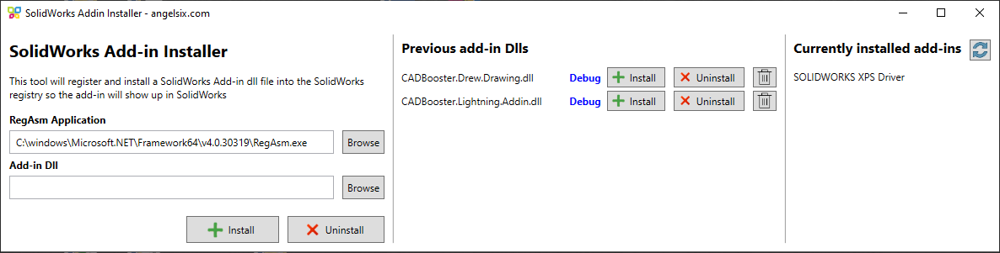

# SolidWorks Add-in Installer
Quickly register your add-ins in the Windows Registry during development so they are loaded when SOLIDWORKS starts.

# How to use
1. Build your add-in project. It does not matter if you do this in Debug or Release mode.
1. Build the add-in installer. This create a "SolidWorksAddinInstaller.exe" in the bin/Debug/net48 or bin/Release/net48folder.
1. Run the .exe
1. Browse for a DLL file that contains your add-in.
1. Click Install. A popup tells you whether it succeeded or failed to register your add-in.

To remove your add-in, click Uninstall in the list of previous add-ins or browse for your DLL and click Uninstall.

Always remove your add-in before making large changes like changing GUIDs or making classes public. Because this tool adds all your public classes to the Windows Registry, you leave lots of traces in the Registry if your don't Uninstall your add-in before making those changes.

# How it works
This tool uses RegAsm to find all public classes in your add-in DLL and to add a reference to those classes in the Registry. Because the SolidAddIn class contains a function with a [ComRegisterFunction] attribute, this function is called during the RegAsm register process. This adds a registry key with the GUID of your add-in to the HKEY_LOCAL_MACHINE\SOFTWARE\SolidWorks\AddIns key.

# How to register an add-in when building an installer
Do not use this tool or RegAsm in an installer when you roll out an add-in product. In that case, you need to register your add-in by adding Windows Registry keys yourself. Every installer tool has its own way of adding registry keys.

Add these steps to your installer:
- Register your public classes:
  - This may include your add-in, your plugin, task pane host and task pane window.
  - Make sure to mark your classes as 64-bit, if your installer has a setting for that, or they end up in the wrong part of the registry.
  - The classes are registered in HKEY_CLASSES_ROOT by their name, and also in HKEY_CLASSES_ROOT\CLSID by their GUID
- Add a key in HKEY_LOCAL_MACHINE\SOFTWARE\SolidWorks\AddIns with the GUID of your add-in in curly braces
  - For example "{37C3FB94-2FE0-47DC-A555-1D4291D0A20D}"
- Add these values to the key you created in the previous step:
  - Description - is required
  - Title - is required
  - Icon path - is optional - contains the full path to the icon you want to show in the list of add-ins within SolidWorks. You can even set a path for each icon size: https://help.solidworks.com/2022/english/api/sldworksapiprogguide/overview/Add-in_Icons.htm